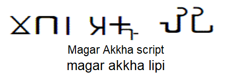
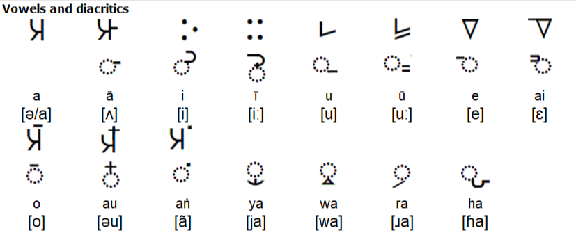
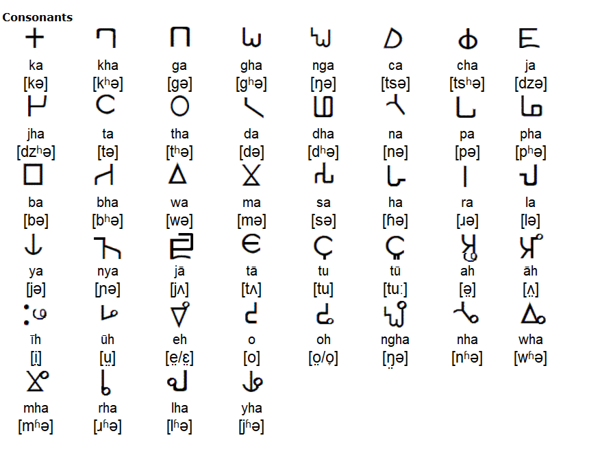
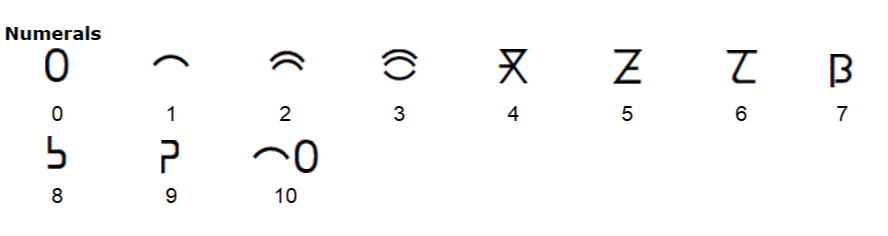
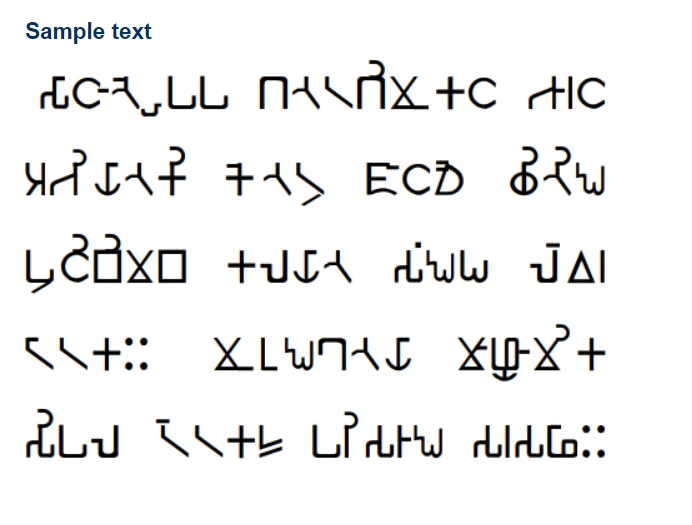

# Magar-Language-Datasets

# Magar

# 𑀫𑫡𑫥𑂞𑀸𑀲𑀸 

The Magar Akkha script is a version of the Brahmi script, that has been used since about the 11th century AD. It is still used to some extent to write Magar, a Tibeto-Burman language spoken in parts of Nepal, and northeast of India. It is taught in some schools and used in one newspaper. These days, the Devanagari script is more commonly used to write Magar.  

Magar Akkha is also known as Magar Akkha Rika or Magar lipi.  
# Notable features 
Type of writing system: *Abugida / Syllabic Alphabet 

Writing direction: *left to right in horizontal lines 

Used to write: *Magar (𑀫𑫡𑫥𑂞𑀸𑀲𑀸 / मगर ढुट‎)

# Magar Alphabet and Pronunciation
Let's have a glance at Magar Alphabet and Pronunciation.
## Vowels and diacritics
* A vowel is a syllabic speech sound pronounced without any stricture in the vocal tract.
* A diacritic (also diacritical mark, diacritical point, diacritical sign, or accent) is a glyph added to a letter or to a basic glyph. 
* Vowels and diacritics in Magar Akkha:

## Consonants
* A consonant is a speech sound that is not a vowel.
* Consonants in Magar Akkha:

## Numerals
* A numeral is a figure, symbol, or group of figures or symbols denoting a number.
* Numerals in Magar Akkha:

## How Sample Text Looks Like?
* Challenge For You!!!
* Can you say what message the following sample text wants to convey?

